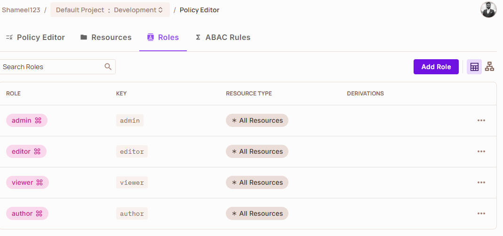
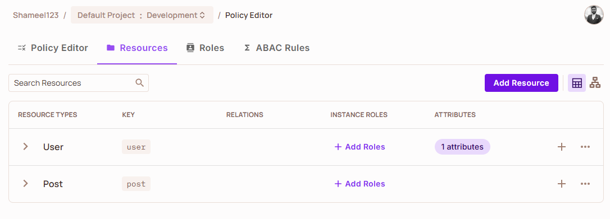
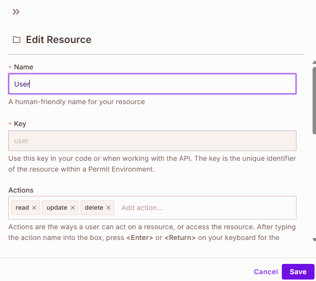
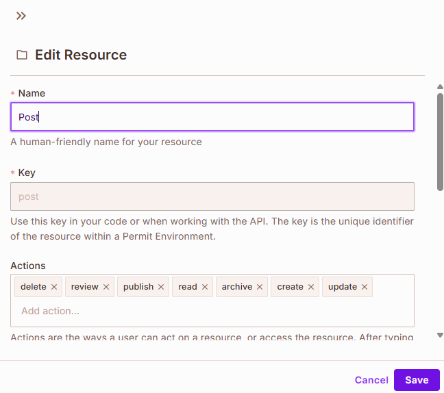
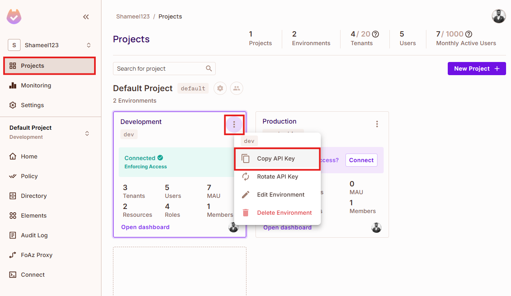

# PermitBlog


A headless blog system built with NestJS providing powerful role-based access control through Permit.io integration. PermitBlog offers a complete backend solution for managing blog posts with sophisticated authorization workflows.

## Features

- **Advanced Authorization**: Role-based access control (RBAC) using Permit.io
- **User Management**: Registration, authentication, and role assignment
- **Content Workflow**: Complete post lifecycle including drafting, co-authoring, review, and publishing
- **RESTful API**: Well-structured endpoints for all operations
- **MongoDB Integration**: Flexible document storage for your content
- **Soft Delete**: Mark records as deleted without permanently removing them from the database 

## 📋 Prerequisites

- [Node.js](https://nodejs.org/) (v22 or higher recommended)
- [npm](https://www.npmjs.com/) (comes with Node.js)
- [MongoDB](https://www.mongodb.com/) (v5.0+ recommended)
- [Permit.io](https://permit.io/) account

## 🚀 Getting Started

### 1. Clone the repository

```bash
git clone https://github.com/yourusername/permitblog.git
cd permitblog
```

### 2. Install dependencies

```bash
npm install
```

### 3. Set up environment variables

Create a `.env` file in the root directory:

```bash
cp env-example .env
```

Then fill in the required configuration:

```
# Permit.io Configuration
PERMIT_IO_PDP='https://cloudpdp.api.permit.io'  # Or 'http://localhost:7766' for local development with docker
PERMIT_IO_TOKEN='permit_key_your_api_key_here' ## Get this from Permit.io Dashboard.
PERMIT_IO_TENANT='permitblog' ## Need to create tanant in Permit.io first.

# MongoDB Configuration
MONGO_DB_URI=mongodb://localhost:27017/PermitBlog

# JWT Configuration
JwtSecret=your_jwt_secret_here
JWT_EXPIRATION=1d

# API Key for Backend Operations
BackendApiKey=your_backend_api_key_here

# Server Configuration
PORT=3001
ENVIRONMENT=development
```
### 4. Set up Permit.io

#### 1. Create a Permit.io account and set up a project

This quickstart from official Permit.io docs should help: https://docs.permit.io/quickstart/

#### 2. Define the following roles in your Permit.io dashboard
- `admin`
- `editor`
- `author`
- `viewer`

Roles are set up in Permit.io like this:


#### 3. Define the following resources
- `Post`
- `User`

Two resources for "User" and "Post" should be here like this:


#### 4. Configure the appropriate permissions for each role-resource combination

Following actions for "User" resource should be set:


Following actions for "Post" resource should be set:


#### 5. Copy your API key from the Permit.io dashboard to your `.env` file




### 5. Start the application

For development:
```bash
npm run start:dev
```

For production:
```bash
npm run build
npm run start:prod
```

## 🔌 Database Setup

### Option 1: Local MongoDB

1. Install MongoDB from the [official website](https://www.mongodb.com/try/download/community)
2. Start the MongoDB service
3. Your connection string will be: `mongodb://localhost:27017/PermitBlog`

### Option 2: MongoDB with Docker

```bash
# Pull the MongoDB image
docker pull mongo

# Run MongoDB container
docker run -d \
  --name PermitBlog \
  -p 27017:27017 \
  -v permitblog_data:/data/db \
  mongo
```

## API Endpoints

### Authentication

| Method | Endpoint        | Description            | Request Body                         | Authorization |
|--------|-----------------|------------------------|--------------------------------------|---------------|
| POST   | `/auth/register` | Register a new user    | `{ "email": "user@example.com", "password": "password" }` | None |
| POST   | `/auth/login`    | Login and get JWT token | `{ "email": "user@example.com", "password": "password" }` | None |

### User Management

| Method | Endpoint        | Description            | Request Body                         | Authorization |
|--------|-----------------|------------------------|--------------------------------------|---------------|
| GET    | `/user/all`     | Get all users          | None                                 | JWT Token |
| POST   | `/user/assign-role` | Assign role to user | `{ "email": "user@example.com", "role": "editor" }` | Backend API Key |

### Posts

| Method | Endpoint        | Description            | Request Body                         | Authorization |
|--------|-----------------|------------------------|--------------------------------------|---------------|
| POST   | `/post`         | Create a new post      | Post object (title, content, tags, etc.) | JWT Token |
| POST   | `/post/:id/co-author` | Add co-author to post | `{ "userId": "user_id" }` | JWT Token |
| DELETE | `/post/:id/co-author/:userId` | Remove co-author | None | JWT Token |
| PATCH  | `/post/:id/submit-for-review` | Submit post for review | Post object | JWT Token |
| PATCH  | `/post/:id/review` | Approve/reject post | `{ "status": "approved" }` or `{ "status": "rejected", "rejectedReason": "reason" }` | JWT Token |
| PATCH  | `/post/:id/publish` | Publish a post | None | JWT Token |
| PATCH  | `/post/:id/archive` | Archive a post | None | JWT Token |
| DELETE  | `/post/:id` | Deletes a post | None | JWT Token |

## Post Workflow

The PermitBlog system implements a complete post workflow:

1. **Creation**: Authors create draft posts
2. **Collaboration**: Authors can add co-authors to their posts
3. **Review Process**: Posts are submitted for review by editors
4. **Publishing**: Approved posts can be published
5. **Archiving**: Published posts can be archived

## Authorization Flow

PermitBlog uses Permit.io to implement the following permission model:

### Admin
- Full access to all resources and actions

### Editor
- Can review and approve/reject posts
- Can publish approved posts

### Author
- Can create, edit and submit their own posts
- Can add co-authors to their posts

### Viewer
- Can view published posts

## Roadmap

### User Management:

**Admin** capabilities:
- [ ] Create user(s)
- [ ] Update user(s)
- [ ] Read all users (Currently any role with `read` permission in Permit.io can read all users)
- [ ] Delete user(s)

**Editor/Author/Viewer** capabilities:
- [ ] Read their own user-related data

### Posts:

**Publish Post | Archive Post | Delete Post:**
- [ ] Migrate co-author logic for archiving posts to ABAC with Permit.io
- [ ] Implement Permit.io-based access control for publishing posts
- [ ] Implement Permit.io-based access control for deleting posts
- [ ] Review and update the `PostService` code to fully utilize Permit.io for post actions

## Contributing

Contributions are welcome! Please feel free to submit a Pull Request.

## License

This project is licensed under the MIT License - see the LICENSE file for details.

## Acknowledgements

- [NestJS](https://nestjs.com/)
- [MongoDB](https://www.mongodb.com/)
- [Permit.io](https://permit.io/)